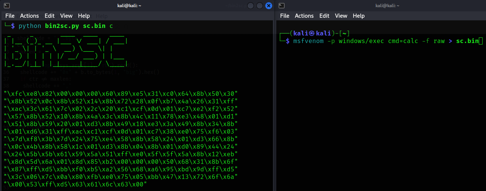

# Convert binary to different outputs

A little helper to convert raw shellcode into different outputs

## Usage

```
python3 bin2sc.py <file>.bin c|casm|cs
```

| Argument | Description       | Output             |
| -------- | ----------------- | ------------------ |
| `c`      | C-style           | `"\x00"`           |
| `casm`   | C inline assembly | `".byte 0x00\n\t"` |
| `cs`     | C-Sharp           | `0x00`             |

### Implementation ideas

bash, c, csharp, dw, dword, hex, java, js_be, js_le, num, perl, pl,
powershell, ps1, py, python, raw, rb, ruby, sh,
vbapplication, vbscript





